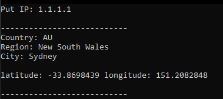

# ipInfo
## Check what's your ip and information differents ip's
```
Shows ip's location (longitude and latitude), region, city and country
```
### SETUP 
```
1) git clone https://github.com/TsuniQwer/ipInfo.git
2) cd ipInfo
2) python3 -m pip install -r requirements.txt
3) python3 ipInfo.py
```

``
 Type 'exit' if you want to quit the program

``




